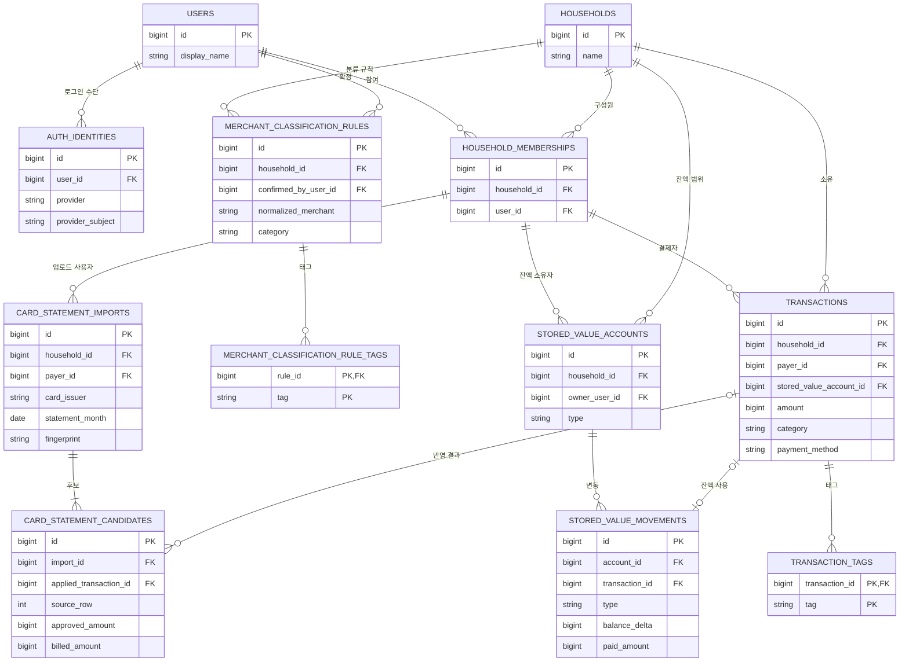

# 데이터 모델

마지막 수정: 2026-08-03

현재 기준: Flyway V13

이 문서는 데이터 관계, 소유권과 금액 의미를 빠르게 이해하기 위한 안내서다. 실제
PostgreSQL 스키마의 유일한 기준은 `apps/api/src/main/resources/db/migration`의 Flyway
migration이다. 모든 컬럼 타입과 인덱스를 이 문서에 복사하지 않는다.

다음 변경에서는 이 문서도 갱신한다.

- 테이블을 추가하거나 삭제할 때
- 주요 외래 키, 소유권 또는 삭제 정책이 바뀔 때
- 금액이나 상태 값의 의미가 바뀔 때
- 애플리케이션이 보장하는 중요한 데이터 불변조건이 바뀔 때

단순 인덱스 추가, 컬럼 길이 조정처럼 관계와 의미가 그대로인 변경은 Flyway에만 기록할
수 있다.

## 핵심 관계

`spring_session`과 `spring_session_attributes`는 로그인 세션을 저장하는 Spring Session
인프라 테이블이라 제품 데이터 ER 그림에서는 제외했다. 세션 속성은 세션 삭제 시 함께
삭제된다.

## 소유권 경계

### Household

`household_id`가 가계 데이터의 접근 제어 경계다. API는 요청에서 household ID를 받지
않고 인증된 `CurrentUser`에서 결정한다.

- 거래, 카드 명세서, 가맹점 분류 규칙과 잔액 계정은 household 범위에 속한다.
- `(household_id, user_id)`는 반드시 `household_memberships`에 존재해야 한다.
- 다른 household의 객체 ID를 전달해도 Repository 조회에 `household_id`가 함께 들어간다.

### 결제자와 잔액 소유자

둘은 같은 개념이 아니다.

- `transactions.payer_id`: 가맹점 거래를 실제로 결제한 구성원
- `stored_value_accounts.owner_user_id`: 온누리상품권·임산부 바우처 잔액의 소유자
- `transactions.stored_value_account_id`: 해당 거래에서 사용한 잔액 계정

한 household 안에서는 결제자와 잔액 소유자가 달라도 기록할 수 있다. AI 초안은 결제자
소유 계정을 기본으로 고르지만 사용자가 확인 단계에서 바꿀 수 있다. 잔액 계정은
`(household_id, owner_user_id, type)` 조합으로 하나만 존재한다.

### 사용자와 로그인 수단

`users`는 내부 사용자이고 `auth_identities`는 Google 같은 로그인 제공자 계정이다.
`(provider, provider_subject)`가 고유하므로 이메일 일치만으로 사용자를 합치지 않는다.

## 금액과 잔액 의미

모든 금액은 소수점 없는 원화 `BIGINT`다.

| 값 | 의미 | 소비 집계 |
| --- | --- | --- |
| `transactions.amount` | 가맹점에서 소비한 액면 금액 | 포함 |
| `stored_value_movements.balance_delta` | 잔액 증가 또는 감소 | 직접 포함하지 않음 |
| `stored_value_movements.paid_amount` | 충전 시 계좌에서 실제 출금된 금액 | 충전 원가이며 소비가 아님 |
| `card_statement_candidates.approved_amount` | 카드 승인 또는 취소 금액 | 사용자 반영 전에는 거래가 아님 |
| `card_statement_candidates.billed_amount` | 명세서 청구 원금 | 대조 근거 |

잔액은 `stored_value_accounts`에 현재 값을 저장하지 않고 연결된
`stored_value_movements.balance_delta`의 합계로 계산한다.

- `CREDIT`: 잔액은 양수 증가, 실제 출금액은 0 이상이며 증가액을 넘을 수 없다.
- `SPEND`: 거래 한 건과 연결되고 잔액은 음수로 감소한다.
- `ADJUSTMENT`, `OPENING_BALANCE`: 거래 없이 잔액만 조정한다.
- 한 거래에는 잔액 사용 변동이 최대 하나만 연결된다.
- 잔액 부족 검증과 거래·변동 저장은 같은 데이터베이스 transaction에서 처리한다.

온누리상품권 10,000원을 9,300원에 충전한 경우 잔액 증가액은 10,000원이고 실제 출금액은
9,300원이다. 이후 2,400원을 사용하면 거래 금액과 잔액 감소액은 각각 2,400원이다.
구매별 실제 원가는 FIFO나 가중평균 정책이 없으므로 계산하지 않는다.

## 거래 규칙

- `amount`는 항상 양수다. 취소 명세서 행은 음수 거래로 새로 만들지 않는다.
- `CARD`는 카드사가 필수다.
- `CASH`, `QR`, `UNKNOWN`은 카드사가 없어야 한다.
- `QR`은 애플리케이션 규칙상 잔액 계정이 필수다.
- 잔액 계정을 사용한다면 결제 경로는 `CARD` 또는 `QR`이다.
- 카테고리는 표준 코드 하나, 태그는 허용 코드 여러 개를 기록한다.
- `classification_source`, `classification_confidence`, `classification_confirmed_at`은
  분류가 어디서 왔고 사용자가 어느 수준으로 확인했는지 나타낸다.
- `updated_at`은 거래 수정의 낙관적 잠금 기준이다.

카테고리 코드는 `FOOD`, `HOUSING`, `TRANSPORT`, `LIVING`, `CHILDCARE`, `HEALTH`,
`LEISURE`, `EDUCATION`, `FINANCE_INSURANCE`, `FAMILY_EVENT`, `OTHER`다. 태그 코드는
`SUBSCRIPTION`, `UTILITY`, `RECURRING_PAYMENT`다.

## 카드 명세서 규칙

- import는 `(household_id, payer_id, card_issuer, fingerprint)` 조합으로 중복을 막는다.
- 원본 파일은 저장하지 않고 정규화된 후보와 논리 fingerprint만 저장한다.
- 후보는 `(import_id, source_row)` 조합으로 고유하다.
- 반영된 거래가 삭제되면 `applied_transaction_id`는 `NULL`로 돌아가 재검토할 수 있다.
- 현대카드 온누리 청구할인 행은 별도 후보가 아니라 직전 구매 후보의 잔액 유형 힌트다.
- 명세서에서 새 온누리 거래를 만들면 업로드한 사용자 소유 계정에 연결한다.

## 가맹점 분류 규칙

- `(household_id, normalized_merchant)` 조합으로 규칙 하나만 존재한다.
- 규칙을 확정한 사용자를 `confirmed_by_user_id`로 남긴다.
- 규칙 삭제 시 연결 태그는 함께 삭제된다.
- 거래 태그와 규칙 태그는 각각 복합 기본 키로 중복을 막는다.

## 삭제와 생명주기

| 대상 삭제 | 연결 데이터 처리 |
| --- | --- |
| 사용자 | 인증 수단과 membership은 cascade 대상이지만 거래 등 참조 데이터가 있으면 삭제가 제한될 수 있음 |
| household | membership, 분류 규칙, 잔액 계정은 cascade 대상이며 거래 참조가 있으면 삭제가 제한될 수 있음 |
| 거래 | 거래 태그와 잔액 `SPEND` 변동 삭제, 명세서 후보의 적용 거래는 `NULL`로 변경 |
| 카드 명세서 import | 모든 후보 삭제 |
| 잔액 계정 | 모든 잔액 변동 삭제, 연결 거래가 있으면 계정 삭제 제한 |
| 가맹점 분류 규칙 | 규칙 태그 삭제 |
| HTTP 세션 | 세션 속성 삭제 |

현재 제품에는 사용자·household·잔액 계정을 직접 삭제하는 API가 없다. 위 규칙은 향후
삭제 기능을 추가할 때 반드시 다시 검토한다.

## 테이블 역할

| 영역 | 테이블 | 역할 |
| --- | --- | --- |
| 인증 | `users` | 내부 사용자 |
| 인증 | `auth_identities` | 외부 로그인 제공자와 내부 사용자 연결 |
| 가구 | `households` | 가계 데이터 격리 단위 |
| 가구 | `household_memberships` | household와 사용자의 구성원 관계 |
| 거래 | `transactions` | 가맹점 소비와 결제·분류 정보 |
| 거래 | `transaction_tags` | 거래의 중복 불가 다중 태그 |
| 분류 | `merchant_classification_rules` | household별 가맹점 기본 분류 |
| 분류 | `merchant_classification_rule_tags` | 분류 규칙의 태그 |
| 잔액 | `stored_value_accounts` | 구성원별 상품권·바우처 계정 |
| 잔액 | `stored_value_movements` | 충전·지급·사용·조정 이력 |
| 명세서 | `card_statement_imports` | 월별 명세서 대조 실행 단위 |
| 명세서 | `card_statement_candidates` | 정규화된 명세서 행과 반영 상태 |
| 세션 | `spring_session` | 서버 로그인 세션 |
| 세션 | `spring_session_attributes` | 직렬화된 세션 속성 |

## Migration 이력

| 버전 | 핵심 변화 |
| --- | --- |
| V1 | 거래 기본 테이블 |
| V2 | 사용자, 인증 수단, household, membership |
| V3 | 거래를 household와 결제자에 연결 |
| V4 | 카드·현금 결제 정보 |
| V5 | PostgreSQL HTTP 세션 |
| V6 | 거래 선택 내역 |
| V7 | 카드 명세서 import와 후보 |
| V8 | 표준 카테고리, 분류 출처·신뢰도, 태그 |
| V9 | 거래 삭제 시 명세서 반영 연결 해제 |
| V10 | 가맹점 분류 규칙과 태그 |
| V11 | 육아 카테고리 |
| V12 | 상품권·바우처 잔액, 변동, 카드·QR 사용 연결 |
| V13 | 잔액 계정을 household 구성원별 소유로 전환 |

이미 적용되거나 커밋된 migration은 수정하지 않는다. 구조를 바꿀 때는 새 번호의
migration을 추가하고 이 문서에는 변경된 최종 관계와 의미를 반영한다.
